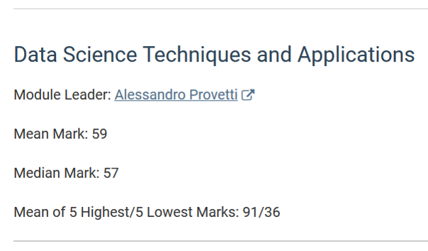
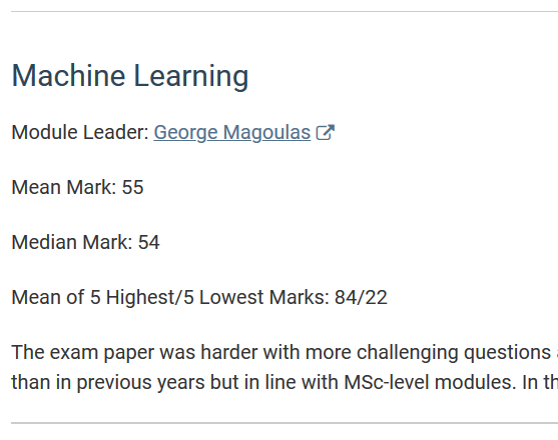

# Data Science: Techniques and Applications (DSTA)

## A new[ish] module

* Designed for MSc Data Science students

* Contents carefully dovetail with existing MSc DS modules

. . .  

*we are in it together*

<!--------------------------------------------------->
## Main topics

* Python modules for DS, ``numpy,`` ``scipy`` etc.

* The geometric view of multidimensional data (Lin. Algebra)

* The data-as-network view (graph algo. from FoC & PwD)

* the text-as-data view (Information Theory)

* a motivating DS problem: sports ranking
  
* selected topics: matrix *slicing:* finding latent dimensions to datasets.  
  
* [discontinued: handling exponentially-distributed data]

<!--------------------------------------------------->
## Important aspects

The inevitable *overfitting* to MSc DS may make this module less appealing to MSc ACT students than the title suggests

. . .

Machine Learning topics are selected so as not to overlap the essential Machine Learning and Applied ML modules.

-----

The table of contents is varied and may appear syncretic wrt. traditional, textbook-based modules..  

. . .

This is a *final* module in charge of synthetising a large, fast-moving area.

. . .

so, expect a more seminarial (than textbook) approach.

## A successful module

Data from 2018-19:

<!--------------------------------------------------->
<!--------------------------------------------------->
# Organization

## About the class

Moodle is the main platform for online interaction and studies

For latest updates and to see the study programme at-a-glance
please refer to the satellite repository:

[http://www.dcs.bbk.ac.uk/~ale/dsta](http://www.dcs.bbk.ac.uk/~ale/dsta/)

Please check your email and MyBirkbeck calendar for time/place amendments.

## In classroom

[Alessandro Provetti](https://www.bbk.ac.uk/our-staff/profile/8920719/alessandro-provetti)

__Teaching Assistants:__

1. [Abul Hasan](https://www.linkedin.com/in/abul-hasan-a2682b92/)

2. [Paschalis Lagias](https://www.linkedin.com/in/paschalis-lagias-ab888057)

3. [Alberto Matuozzo](https://www.linkedin.com/in/alberto-matuozzo-2a504a8/)

<!---------------------------------------------------------------->
## Please see your

* PG admins for support in navigating school
  

. . .

* TAs for support with lab experience 
  
 

 
  

. . .

* module coordinator about the study materials
  

<!----------------------------------------------------------------->
## Too many e-mails

