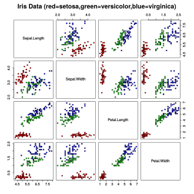

# Dealing with 2D numerical data

## Classifying iris flowers

[[Fisher, 1936]](https://onlinelibrary.wiley.com/doi/abs/10.1111/j.1469-1809.1936.tb02137.x)

Can flower samples be assigned to their proper sub-family purely on the basis of quantitative observation?

* Linear discriminant classification

* high-quality, annotated dataset

* easily the most cited dataset in the ML literature

-----

## Agenda for the lab

* Describing Fischer's Iris dataset

* Using python to analyse the Iris dataset

* Histograms and scatter plots

-----

## Images from [Wikipedia](https://en.wikipedia.org/wiki/Iris_flower_data_set)

### Setosa


## Versicolour


## Virginica


-----

**Instance:**

* 150 samples/datapoints, each having over 4 numerical dimensions $\mathcal{D_1,} \dots \mathcal{D_{4}}$

* an expert classification function over 3 categories

. . .

**Solution:**

a linear combination $\mathcal{D_1} \times \dots \mathcal{D_{4}}\rightarrow \mathcal{D_5}$

that *respects* the given classification.

. . .

**Measure:** *agreement* with the given classification.

## The Iris dataset

n=150 samples manually assigned by Fisher.

d=5 dimensions, four measurements  and the classification

k=3 classes: Setosa, Versicolour and Virginica, 50 instances each, all available from

* the [iris.csv](./data/iris.csv) file from our class repo.
  
* [scikit-learn](https://scikit-learn.org/stable/auto_examples/datasets/plot_iris_dataset.html)

* The [UCI Machine Learning Repository](https://archive.ics.uci.edu/ml/datasets/iris)

## The predictors

* sepal length;
* sepal width;
* petal length, and
* petal width.

All measurements are in cm.

-----

## Loading the dataset

The``iris.csv` file is a comma separated file. To load the dataset into the memory we follow the following steps:

1. Read the file using Pandas.
2. For each row, split them by comma. This will create a list of strings for the row. Then map the strings into the float value.
3. Map the classes to an integer value.
4. Convert the row lists called as \texttt{data} in the program into a numpy array.

## Histogram

A graph consisting of rectangles whose area is proportional to the frequency of a feature and whose width is equal to the class interval denoted as bins

## Scatter plot

A scatter plot is a type of plot or mathematical diagram using Cartesian coordinates to display values for typically two variables for a set of data.

* A 2D visualization of datapoints against Cartesian coordinates.
  
* Normally, the measured variable is on the x-axis.
  
* if time is available then it is always on the x-axis.

-----

```python
from sklearn import datasets
```

```python
iris = datasets.load_iris()

print(iris['data'])

print(iris['target'])
```

## An alternative solution

Self-study this interesting package [ucimlrepo](https://pypi.org/project/ucimlrepo/)

```python
pip install ucimlrepo
```

```python
import pandas as pd
from ucimlrepo import fetch_ucirepo 
  
ID = 53

iris = fetch_ucirepo(ID) 
  
# data (as pandas dataframes) 
X = iris.data.features 
y = iris.data.targets 
  
print(iris.metadata) 
  
print(iris.variables) 
```

-----

## Try visualising the data

Open the exercise files, read the code then run it.

* exercise: plot the histogram of the sepal-width column

See the [Matplotlib tutorial](https://matplotlib.org/3.1.1/gallery/statistics/hist.html)

* exercise: plot the scatter plot of the sepal width against the sepal length
  
See the [Matplotlib tutorial](https://matplotlib.org/3.1.1/api/_as_gen/matplotlib.pyplot.scatter.html)

## Try at home

