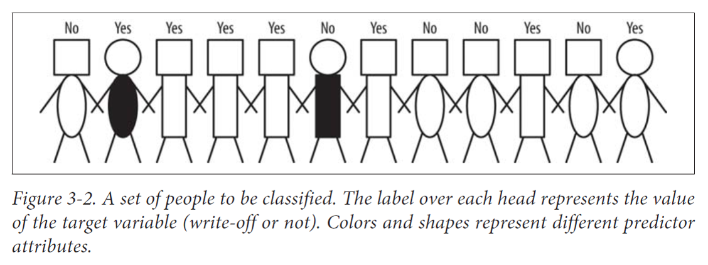
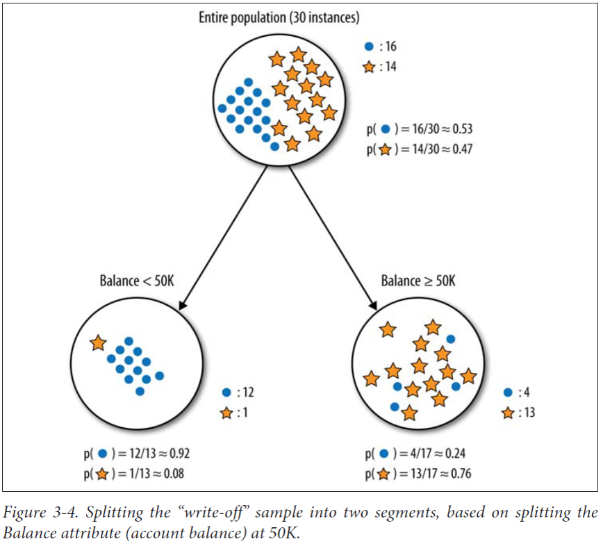
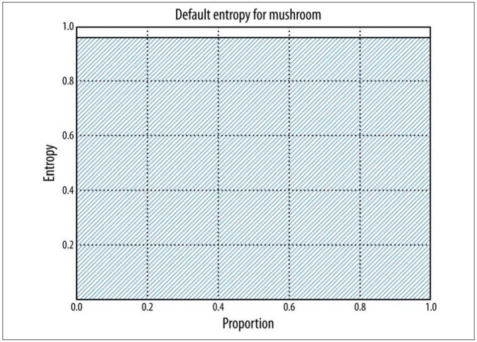
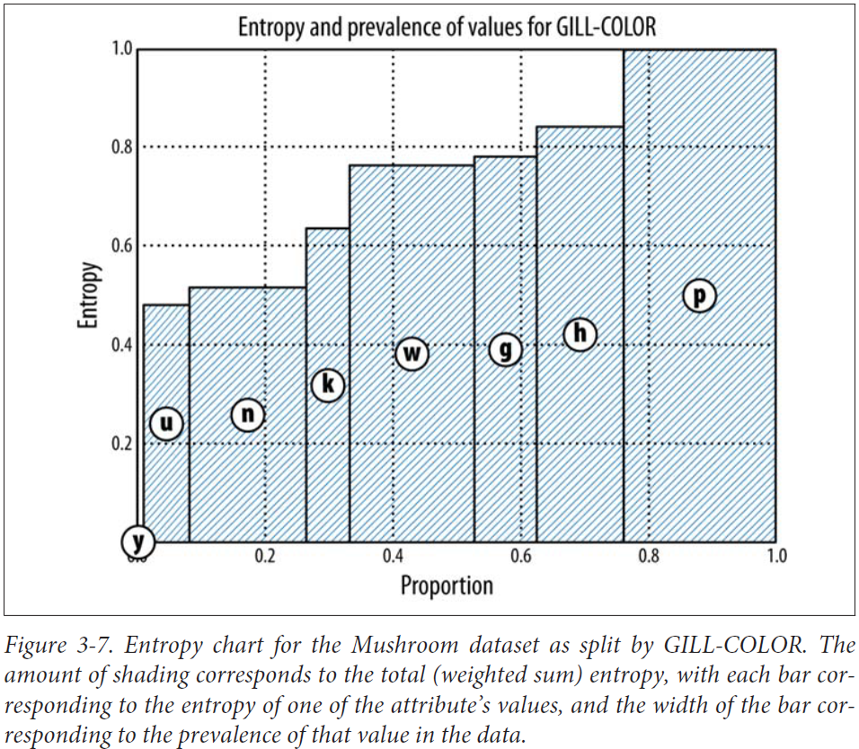
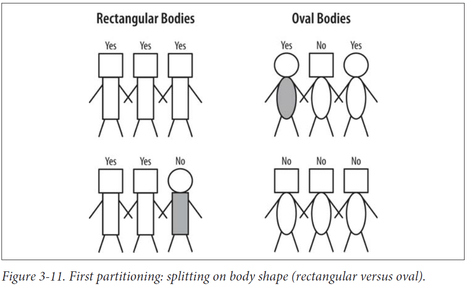
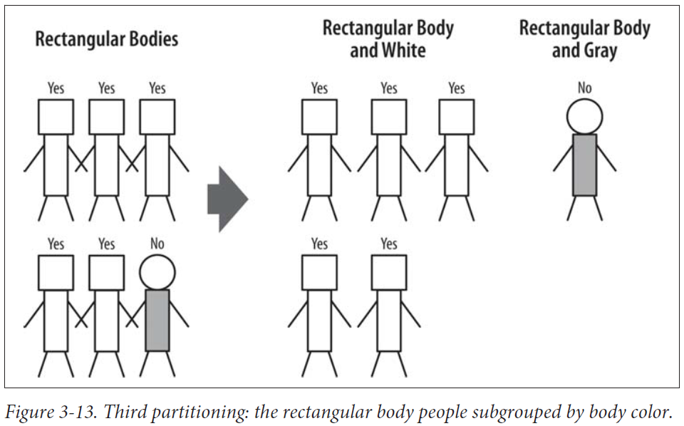
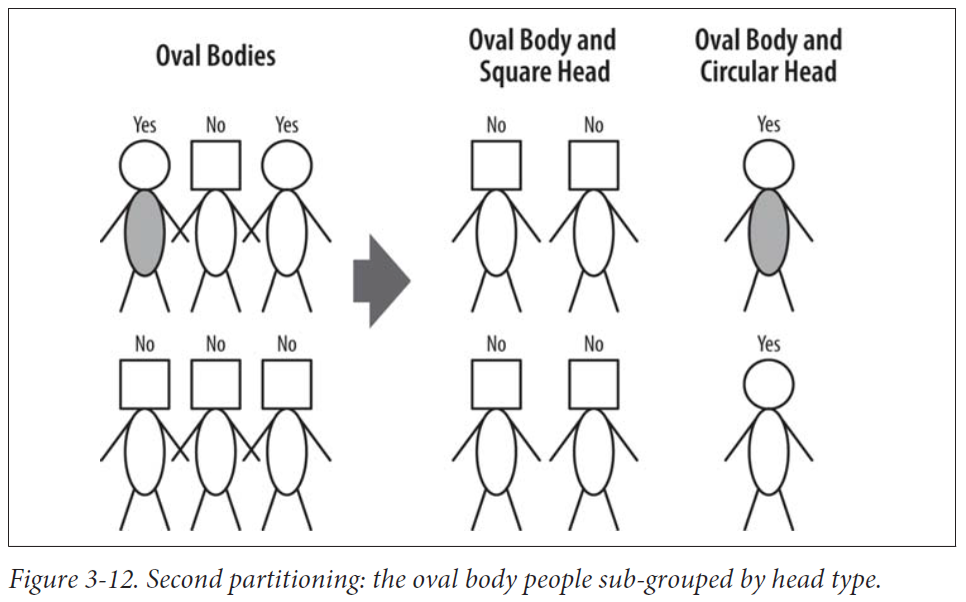
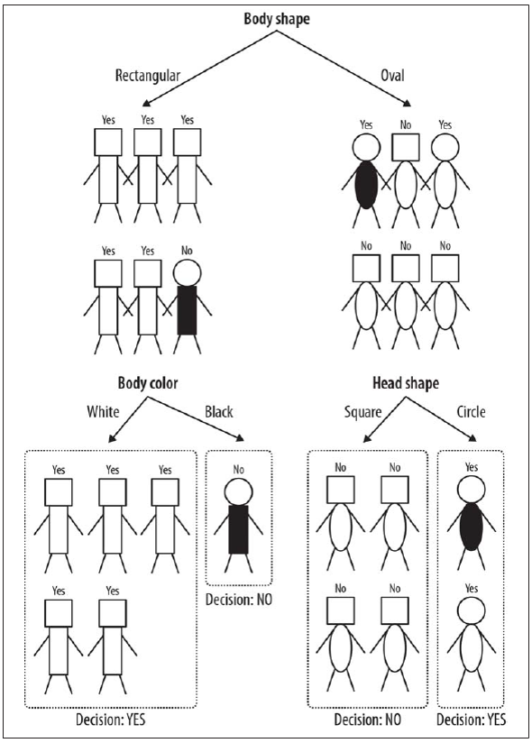

## Decision trees

## Materials

Ch. 3 of Provost-Fawcett's [Data Science for Business](https://www.researchgate.net/publication/256438799_Data_Science_for_Business)

## Motivations

- introduce the concepts described in Ch. 3

- familiarize with the concepts, work with Entropy

- detail the treatment of binary classification

<!------------------------>
# Models

## A simplified representation of reality

A predictive model is a formula for estimating the unknown value of interest, often called the *target* attribute.

. . .

Regression: numerical target

. . .

Classification: class membership, e.g., Class-probability estimation

-----

A descriptive model is a formula for estimating the underlying phenomena and causal connections between values.

Descriptive modeling often is used to work towards a causal understanding of the data-generating process (e.g., why do users watch Sci-Fi sagas?)

## Supervised segmentation

divide the dataset into  *segments* (sets of rows) by the value of their output variable.

. . .

*If the segmentation is done using values of variables that will be known when the target is not then these segments can be used to predict the value of the target.*

Example: the golf days example seen when studying Gini.

Day | Outlook | Temp. | Hum. | Wind | Play?
|---|---|---|---|---|---|
1 | Sunny | Hot | High | Weak | No
2 | Sunny | Hot | High | Strong | ?

## Questions

What are the variables that contain important information about the target variable?

Can they be selected automatically?

## Selecting informative attributes

-----

- Attributes

  - head-shape: {square, circular}
  - body-shape: {rectangular, oval}
  - body-color: {gray, white}

- Target

  - write-off: {yes, no}

Measure:

purity of segments: homogenity wrt. the target variable.

## Complications

1. attributes seldom split a dataset perfectly.

2. if the second person wasn't there, *body-color=gray* would splits off one single data point, hence pure. Is it desirable? (see last slide)

3. Non-binary attributes in binary classification

4. non-discrete attributes

<!-- -->
# Information gain

## Definition

<!-- 	-->

It measures how much much an attribute improves (decreases) entropy over the whole segmentation it creates.

How much purer are the children wrt. the parent segment?

-----

-----

IG(parent, children) = H(parent) - $[prop(c_a)\times H(c_a) + prop(c_b)\times H(c_b) + \dots ]$

where $prop(c_x)$ is the proportion of el. assigned to $c_i:$ $\frac{|c_i|}{n}$ 

. . .

$IG(P, C)$ is connected with Kullback-Leibler divergence.

-----

H(parent) = 0.99

H(left) = 0.39

H(right) = 0.79

$IG(p, C) = 0.99 -[13/30\cdot 0.39 + 17/30 \cdot 0.79] = 0.37$

Notice the *discretization* of the numerical var. we *split on*

-----

H(parent) = 0.99

H(left) = 0.54

H(center) = 0.97

H(right) = 0.98

IG(p, C) = 0.13

## Numeric targets

Discretization may reduce numerical dimensions to discrete ones  

In regression, variance works as the analogous of information entropy.

<!------------------------>
# Attr. selection with IG

## By example

A graphical method deployed to visualize Information gain:

The shaded area represents Entropy.

the white area 'reclaimed' from the shade is the Information gain at each attempt.

-----

total: 8124 instances

edible: 4208 (51.8%)

poisonous: 3916 (48.2%)

H = $-[0.518\log 0.518 + 0.482\log 0.482]$ = $-[.518\cdot -.949 + .482\cdot -1.053]$ = .999

-----

-----

<!-- -->
# Decision trees (DTs)

## DT: iterated supervised segmentation

node $\rightarrow$ leaves represents a segmentation that increases *purity,* i.e., decreases information Entropy or Gini impurity.

. . .

Iterate until the set of all root $\rightarrow$ leaf trajectories gives a complete classification.

. . .

Measure: total entropy of the set of leaf segments.

__Decision tree:__ a set of if-then rules over attribute (or discretized) values

Each observation falls into 1! leaf, and each leaf is uniquely defined by a set of rules.  

## CART, visually

-----

-----

-----

---|---
 | [Fig. 3.12](./imgs/pf-figure-3-12.png)

-----

-----

## Att. seldom split a group perfectly

Even if one subgroup happens to be pure, the other may not!

If the second person were not there, then ``body-color=gray`` would create a pure segment (write-off=no).

However, the other associated segment, ``body-color=white``, still is not pure.

``body-color=gray`` only splits off one single data point into the pure subset.  

Is this better than another split that does not produce any pure subset, but reduces the impurity more broadly?  
