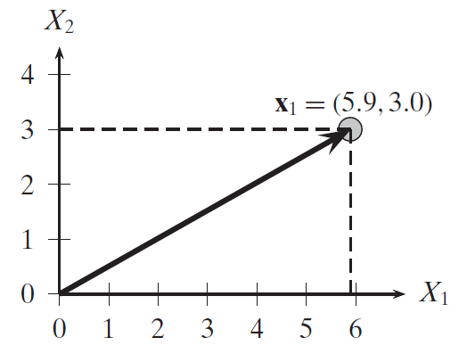
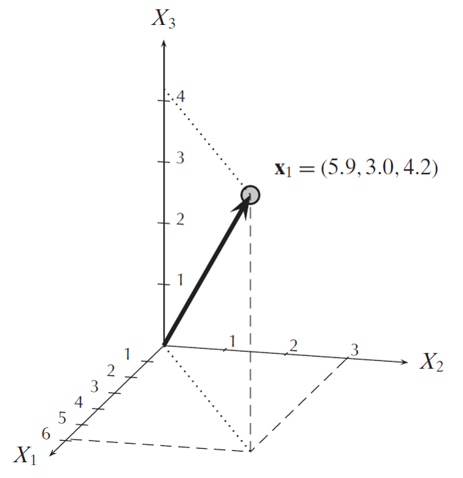

# Eigenpairs

## Study material

I. Goodfellow, Y. Bengio and A. Courville:

[Deep Learning, MIT Press, 2016](https://www.deeplearningbook.org/).

J. Lescovec, A. Rajaraman, J. Ullmann:

[Mining of Massive datasets, MIT Press, 2016](http://www.mmds.org/).

The material covered here is presented in the HTML/PDF excerpts available for download.

<!------------------------------------------------------------->
# Spectral Analysis

##  Eigenpairs

If, given a matrix $A$ we find a real $\lambda$ and a vector __e__ s.t.

$$A\mathbf{e} = \lambda \mathbf{e}$$

then $\lambda$ and __e__ will be an eigenpair of A.

. . .

In principle, if A has rank n there should be n such pairs.

. . .

In practice, eigenpairs

* are always _costly_ to find.

* they might have $\lambda=0$: no information, or
  
* $\lambda$ might not be a real number: no interpretation.

## Conditions for _good_ eigen-

A square matrix _A_ is called _positive semidefinite_ when for any __x__ we have

$$\mathbf{x}^T A \mathbf{x} \ge 0$$

In such case its eigenvalues are non-negative: $\lambda_i\ge 0$.

## Underlying idea, I

In Geometry, applying a matrix to a vector, $A\mathbf{x}$, creates all sorts of alteration to the space, e.g,

* rotation

* deformation

Eigenvectors, i.e., solutions to $A\mathbf{e} = \lambda \mathbf{e}$

describe the direction along which matrix A operates an __expansion__

## Example: shear mapping

```python
A = [[1, .27],
     [0,   1]
    ]
```

deforms a vector by increading the first dimension by a quantity proportional to the value of the second dimension:

$$
\begin{bmatrix}
    x\\
    y
\end{bmatrix}
\longrightarrow 
\begin{bmatrix}
    x + \frac{3}{11}y\\
    y
\end{bmatrix}
$$

-----
](./imgs/mona_lisa.png)


The blue line is unchanged:

* an $[x, 0]^T$ eigenvector

* corresponding to $\lambda=1$

## Activity matrices, I

Under certains conditions:

-the eigenpairs exists,

-e-values are real, non-negative numbers (0 is ok), and

-e-vectors are orthogonal with each other:

. . .

User-activity matrices normally meet those conditions!

## Activity matrices, II

If an activity matrix has _good_ eigenpairs,

. . .

each e-vector represents a *direction*

we interpret those directions as *topics* that hidden (latent) within the data.

e-values *expand* one's affiliation to a specific *topic*.

# Norms and distances

## Euclidean norm

$||\mathbf{x}|| = \sqrt{\mathbf{x}^T\mathbf{x}} = \sqrt{\sum_{i=1}^m x_i^2}$



Pythagoras' theorem, essentially.

. . .

Generalisation:

$||\mathbf{x}||_p = (|x_1|^p + |x_1|^p + \dots |x_m|^p)^\frac{1}{p} = (\sum_{i=1}^m |x_i|^p)^\frac{1}{p}$

-----



. . .

The Frobenius norm $||\cdot ||_F$ extends $||\cdot ||_2$ to matrices

## Normalization

The *unit* or *normalized* vector  of $\mathbf{x}$

$$
\mathbf{u} = \frac{\mathbf{x}}{||\mathbf{x}||} = (\frac{1}{||\mathbf{x}||})\mathbf{x}
$$

* has the same direction of the original

* its norm is constructed to be 1.  

<!--------------------------------------------------->
# Computing Eigenpairs

## With Maths

$$
M\mathbf{e} = \lambda \mathbf{e}
$$

. . .

Handbook solution: solve the equivalent system

$$
(M - \lambda \mathbf{I})\mathbf{e} = \mathbf{0}
$$

. . .

Either of the two factors should be 0. 
Hence, a non-zero __e__ is associated to a solution of

$$
|M - \lambda \mathbf{I}| = 0
$$

---

$$
|M - \lambda \mathbf{I}| = 0
$$

In Numerical Analysis many methods are available.

Their general algorithmic structure:

-find the $\lambda$s that make $|\dots | = 0$, then

-for each $\lambda$ find its associated __e__.

---

## With Computer Science

At Web scale, few methods will still work!

Ideas:

1. find the e-vectors first, with an iterated method.

2. interleave iteration with control on the *expansion in value*  

. . .

$\mathbf{x_0} = [1, 1, \dots 1]^T$

. . .

$\mathbf{x_{k+1}} = \frac{M\mathbf{x}_k}{||M\mathbf{x}_k||}$


. . .

until an approximate fix point: $x_{l+1} \approx x_{l}$.

-----

Now, eliminate the contribution of the first eigenpair:

$$
M^* = M - \lambda_1^\prime \mathbf{x}_1 \mathbf{x}_1^T
$$

(since $\mathbf{x}_1$ is a column vector, $\mathbf{x}_1^T \mathbf{x}_1$ will be a scalar: its norm.
Vice versa, $\mathbf{x}_1 \mathbf{x}_1^T$ will be a matrix)

. . .

Now, we repeat the iteration on $M^*$ to find the second eigenpair.  

Times are in $\Theta(dn^2)$.  

For better scalability, we will cover [Pagerank](https://en.wikipedia.org/wiki/PageRank) later.

<!------------------------------------>
# Eigenpairs in Python

## E-pairs with Numpy

```python
from numpy import linalg as LA
```


```python
def find_eigenpairs(mat):
	"""Test the quality of eigenpairs by Numpy
	"""
	n = len(mat)

	m = len(mat[0])

	eig_vals, eig_vects = la.eig(mat)

	# they come in ascending order, take the last one on the right
	dominant_eig = abs(eig_vals[-1])
```

E-values come normalized: $\sqrt{\lambda_1^2 + \dots \lambda_n^2} = 1$; hence we later multiply them by $\frac{1}{\sqrt{n}}$
