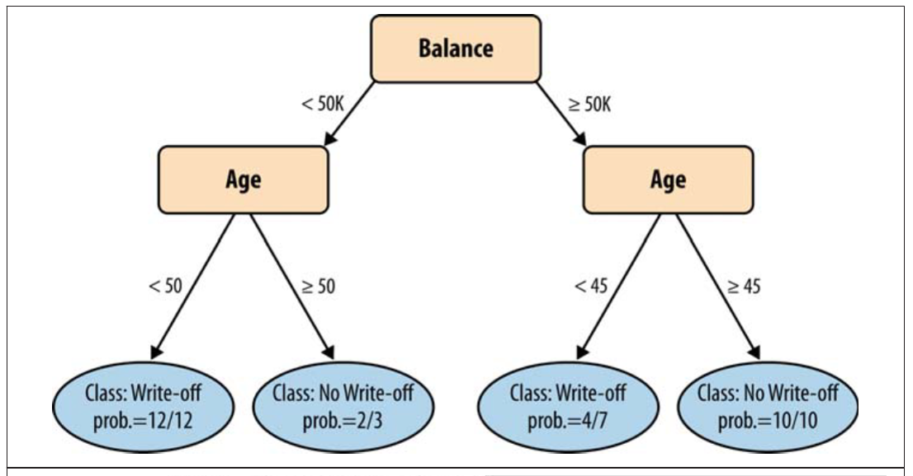

## Decision-trees: keywords

Discretization, iterated binary segmentation, *misclassification* ...


## Decision-trees: more keywords

Purity, Entropy, Information Gain, root-to-leaf ...



---

## Dataset: banknote authentication

Visit the [UCI ML Repository](https://archive.ics.uci.edu/ml/datasets/banknote+authentication).


Wavelet transformation yields the following features:

* variance, skewness, curtosis and

* entropy of image.

One (integer) classification value: class

---

## Implementing a decision tree

The Banknotes dataset, baseline code and model solutions are all available from the class channels: Moodle, GitHub, etc.

---

## Objective A: write our own Gini function

1. inspect a Decision-tree baseline code

2. Lay out a function that segments the data according to the best Gini values available.:

Remember: Gini=0 is the best scenario

---

```python
def get_split(dataset):
    b_index, b_value, b_score, b_groups = 999, 999, 999, None

    # TODO: Find the best possible place to split the dataset
    #
    # TODO: assign datapoints to 'left' and 'right' segments
    # using the test_split(index, value, dataset)
    # function.
    #
    # TODO: define a gini_index(groups, classes)
    # func. to construct a branch of the tree

    return {'index':b_index, 'value':b_value, 'groups':b_groups}
```

---

## Objective a, cont'd

Compute Gini index for a split dataset

```python
def gini_index(groups, classes):

    total_gini = 0.0

    # TODO : For each group, calculate its Gini index.

    return total_gini
```

A model solution for this exercise is available but please attempt your solution first.

If you are uncertain on how to write this type of function you can go directly to the model solution.

---

## Objective b: write your own DT generator

Can you write Python functions that iteratively segment the data until you have a decision tree?
