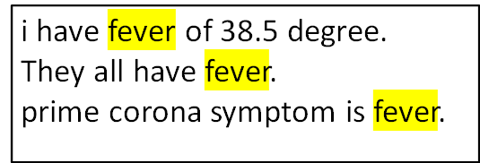
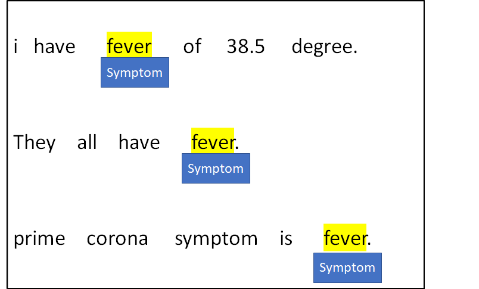
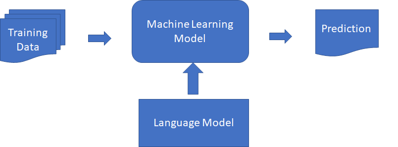
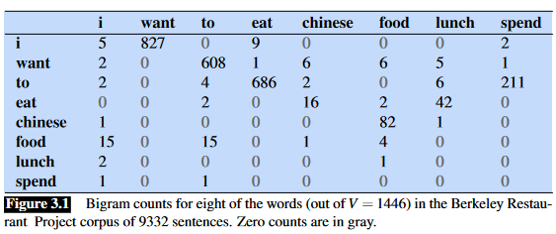
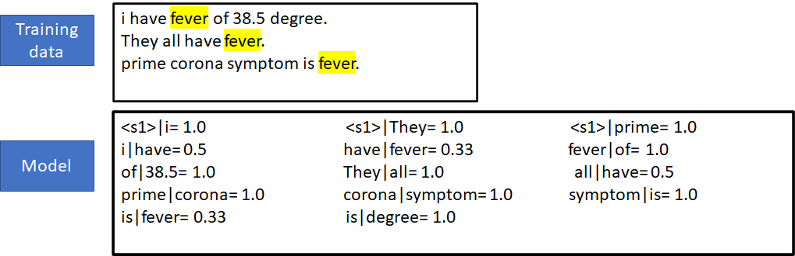

## NLP and Entropy measures

## Motivations

Today, Natural language processing (NLP) is advancing thanks (mostly) to the deployment of sophisticated Machine Learning architectures.

A key enabling factor is the ready availability of large corpora which feed extensive training of the ML architectures

-----

New computational problems are now addressed.
Example: given a prompt text, complete the phrase in an intelligible (i.e., human) way.

. . .  

Entropy helps us understand and evaluate progress in NL, e.g., in language generation.

## Agenda

* A general introduction to NLP

* Language models: a quick glance

* introduction of Cross-entropy

<!-- ---------------------- -->
# Current Topics in NLP

## Named entities

Suppose, we want to extract Coronavirus symptoms from a stream of Twitter posts dedicated to Covid-19.

Finding a new symptom is the task of *Named Entity Recognition (NER).*

-----

Definition:

given a text find all persons, locations and organisations that the text refers to.

## More challenges

### Language generation (prompt generation)

given the initial part of a phrase, called `prompt` give a *proper* completion of the phrase.

. . .

#### Question answering  

Given a question in natural language, reply to it *properly.*

We need a metrics to determine what is *proper* for a solution.

-----

#### Phrase completion

__Instance:__ a phrase/sequence of words W

__Solution:__ the next word(s) in the phrase.

. . .

We will focus on this problem.

## Supervised ML

Named entity recognition (and others) are normally addressed by means of a *supervised Machine Learning model.*  

It starts with human, reliable annotation of example texts: the training data.

-----

If *well-trained,* the ML model will be capable of predicting the entities in new text.

<!-- ----------- -->
# Phrase Completion

## Predicting the next word

An algorithm which assigns probabilities to sequences of words is called a *language model (LM).*

The simplest model assigns probabilities to sentences and sequences of words, the *n-gram.*

## N-gram models

An n-gram is a sequence of n words:

2-gram (bigram): “switch off” or ”your homework”

3-gram (trigram): “please turn your,” or “turn your homework”.

-----

N-gram prediction is based on probabilities.  
Probs. are extracted from frequencies of co-occurence in corpora.

. . .

This bigram tabled by [Martin-Jufrasky] is a LM in itself

## How to evaluate results

N-gram models estimate the probability of the last word of an n-gram given the previous words.

Which is the best N-gram model?

To rate them we need Information theory.

<!-- --------------- -->
# Cross Entropy

-----

## Approach

Let's consider N-grams.  

What is the best N-gram model for predicting the next word of a sequence W?

Information theory provides an abstract yet effective tool to evaluate the quality of solutions (against some test data).

## Preliminaries

Let P(i) and Q(i) be two prob. distributions drawn from the same underlying set of $n$ possible *outcomes:* $X=\{x_1, \dots x_n\}$.

Let P(i) be the current distribution: the text to be evaluated.

Let Q(i) be the *reference distribution,* given by the model (trained on the whole corpus).

The cross-entropy $H(P, Q)$ is defined as

$$H(P,Q) = -\sum_{i=1}^{n}p(x_{i}) \log q(x_{i})$$

## Perplexity

Cross-entropy: $H(P,Q) = -\sum_{i=1}^{n}p(x_{i}) \log q(x_{i})$

. . .

Perplexity: $PP(H, Q)= 2^{H(P, Q)}.$

A lower perplexity indicates a better model.

## Computing perplexity

Large-scale NLP models provide a convenient approximation  

Let $W = w_1, \dots, w_N$ be the phrase at hand.  

For each word occurence $w_i$, the model assigns a prob. $P(w_i)$.  

Now, Entropy approximates the cross-entropy of W:

$H(W) \approx - \frac{1}{N} \log P(W)$

. . .  

$H(W) \approx - \frac{1}{N} \log \Pi_{i=1}^{N} P(w_i)$

## Perplexity in action

What is the perplexity of the following test sentence (notice grammar)?

W = ``prime corona symptom is fever and cough``

-----

W = ``prime corona symptom is fever and cough``

W is now our P distribution

$\frac{1}{N}=\frac{1}{7}$

$P(W) = \Pi_{i=1}^{N} P(w_i) = 1 \times 1 \times 1 \times 1 \times 0.33 \times 1 \times 1 =0.33$

-----

Let's compute the Cross entropy of W:

$H(W) \approx - \frac{1}{N} \log \Pi_{i=1}^{N} P(w_i)$

. . .

$H(W) = -\frac{1}{7}\cdot \log(1\cdot 1 \cdot 1 \cdot 1 \cdot 0.33 \cdot 1 \cdot 1 )$

. . .

$H(W) = -\frac{1}{7} \cdot (-0.625) = 0.089$

$PP(W) = 2^{H(W)} = 2^{0.089} = 1.063$

## Mastering perplexity

$H(W)$ is the average number of bits needed to encode each word.  

$P(W)=2^{H(W)}$ is the average number of words that can be encoded using H(W) bits.

. . .

__However...__

-----

We interpret perplexity as a weighted branching factor for the possible completions of W.  

If PP=1 there is no doubt on what the next word should be.

If PP=100 then whenever the model is trying to guess the next word it is as confused as if it had to pick between 100 words.  

-----

W = ``I study at Birkbeck...``

which is the next likely word?

. . .

$M_1$: ``College``

with perplexity 3: ``University`` and ``London`` are also highly probable completions.

$M_2$: ``University``

with perplexity 1.5: ``College`` is the only medium-probability alternative.

We prefer $M_2$ as the lowest-perplexity model.
